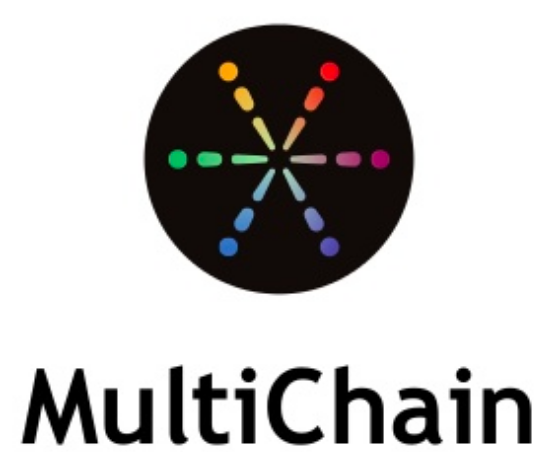
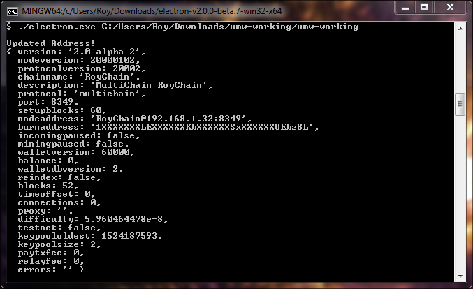
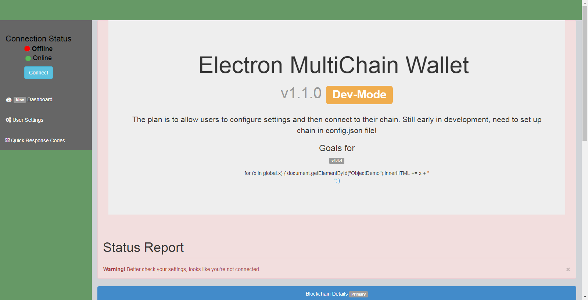
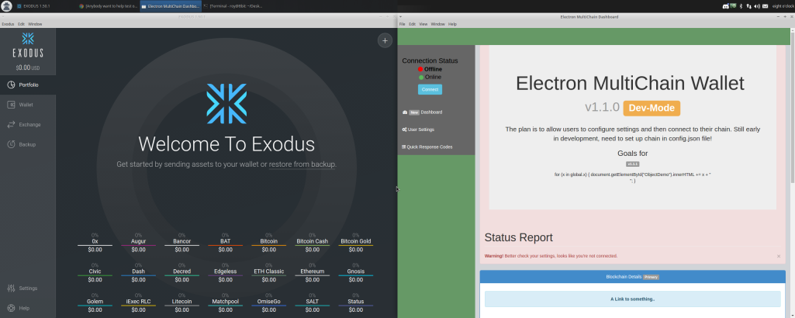

# Universal Wallet Documentation

## What is the Universal Wallet?

The Universal Wallet is a \(GUI\) Graphical User Interface Wallet for [MultiChain](https://www.multichain.com/) Blockchains & Many Others. 


MultiChain is an open platform for building public or private permission-based blockchains.


## What is it used for?

The Universal Wallet can be used for a variety of purposes. Some of those could include, modifying it and pairing it with your own Multichain blockchain parameter\(s\) file. Using the  Wallet alongside MultiChain allows for an end-user to create a new multichain blockchain and pair it with a graphical wallet. Until the Universal Wallet came along, this was not possible. As MultiChain was operated only from the CLI.

## GUI Wallet Preview

## Is It Open Source?

Yes.

## Where did you get the design?

We took alot of our UI/UX inspiration from similiar technologies. \([Exodus](https://www.exodus.io/) Wallet\)

## Can I Re-Distribute the Photon wallet as my own wallet?

Please see license.md

