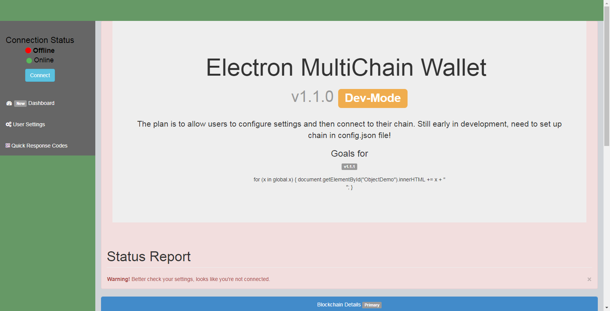

# Photon Wallet ChangeLog

## v1.0.0

### Introduced

* Introduced a few npm packages into an Electron Boilerplate.

1. multichain-node
2. multichain-api
3. bluebird
4. more to be named later maybe...

## v1.1.0

### Fixed

* Software now allows for control of blockchain connection thru a config file.
* Also, introduced a bootstrap template for UI/UX purposes.

## v1.1.1

### Changed

* UI/UX has been changed to reflect Exodus wallet.

